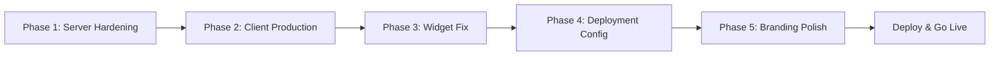

# Production-Grade Voice Agent — Implementation Plan

## Current State Analysis

Your **ElliraAI / ShifraAI** project is a voice assistant SaaS platform where users create embeddable AI-powered voice widgets for their websites. The current codebase is a working prototype with:

| Layer | Stack | Status |
|-------|-------|--------|
| **Frontend (Dashboard)** | React 19 + Vite + Tailwind v4 | Working, clean UI |
| **Backend (API)** | Express 5 + MongoDB + JWT | Functional, needs hardening |
| **Embeddable Widget** | Vanilla JS + CSS (`assistant.js/css`) | Working, all URLs hardcoded to `localhost` |
| **AI Engine** | Gemini 3.5 Flash via REST | Working |
| **Auth** | Firebase Google Sign-in → JWT cookie | Working |
| **Payments** | Razorpay integration | Working |

---

## Critical Issues Found

### 🔴 Blockers for Production

| # | Issue | File | Severity |
|---|-------|------|----------|
| 1 | **All URLs hardcoded to `localhost`** — Widget (`assistant.js`), dashboard (`App.jsx`), and server CORS all point to `localhost:5173` / `localhost:8000` | Multiple files | 🔴 Critical |
| 2 | **JWT secret hardcoded in `.env`** — `"NQSJ2143523SANDSV54F34"` visible in repo | `Server/.env` | 🔴 Critical |
| 3 | **Gemini API key stored in plain text** in MongoDB — no encryption | `user.model.js`, `user.controller.js` | 🔴 Critical |
| 4 | **Cookie `secure: false`** — auth cookies sent over HTTP | `auth.controller.js` | 🔴 Critical |
| 5 | **No rate limiting** — API vulnerable to abuse/DDoS | `Server/index.js` | 🔴 Critical |
| 6 | **Bug: `user.plan === "free"` instead of `user.plan = "free"`** — assignment vs comparison on line 45 | `assistant.controller.js` | 🔴 Bug |
| 7 | **No `assistant.js` build process** — widget references localhost URLs for CSS, logo, mic SVG | `Client/public/assistant.js` | 🔴 Critical |
| 8 | **`node_modules` in git** — server `.gitignore` only excludes `.env` | `Server/.gitignore` | 🟡 Important |
| 9 | **No error boundaries** — React app crashes on any component error | Client | 🟡 Important |
| 10 | **`Gemini_URL` uses non-SDK approach** — no Google GenAI SDK, raw fetch with API key in URL | `Configs/gemini.js` | 🟡 Important |

---

## Proposed Changes

### Phase 1: Server Production Hardening

---

#### [MODIFY] [index.js](file:///f:/github%20repo/voice-agent/Server/index.js)
- Add **helmet** for security headers
- Add **express-rate-limit** for API rate limiting (100 req/15min for auth, 30 req/min for assistant)
- Add **morgan** for request logging
- Dynamic CORS origin from environment variable (`ALLOWED_ORIGINS`)
- Add **graceful shutdown** handler
- Add **health check** endpoint (`GET /health`)
- Connect to DB before starting listener (await `connectDB()`)

#### [MODIFY] [.env (template)](file:///f:/github%20repo/voice-agent/Server/.env)
- Add `ALLOWED_ORIGINS` (comma-separated origins)
- Add `NODE_ENV` (development/production)
- Add `GEMINI_ENCRYPTION_KEY` for encrypting user API keys
- Remove hardcoded JWT secret (use crypto-generated one)

#### [MODIFY] [ConnectDB.js](file:///f:/github%20repo/voice-agent/Server/Configs/ConnectDB.js)
- Add connection retry logic (3 retries with exponential backoff)
- Exit process on persistent DB failure
- Add mongoose connection options (`serverSelectionTimeoutMS`, `heartbeatFrequencyMS`)

#### [MODIFY] [auth.controller.js](file:///f:/github%20repo/voice-agent/Server/Controllers/auth.controller.js)
- Set `secure: true` when `NODE_ENV === 'production'`
- Set `sameSite: 'none'` for cross-origin production cookie
- Add input validation (email format check)

#### [MODIFY] [isAuth.js](file:///f:/github%20repo/voice-agent/Server/Middleware/isAuth.js)
- Return 401 (not 400) for missing/invalid token
- Add token expiration check
- Catch `JsonWebTokenError` and `TokenExpiredError` specifically

#### [MODIFY] [assistant.controller.js](file:///f:/github%20repo/voice-agent/Server/Controllers/assistant.controller.js)
- **Fix bug**: Line 45 `user.plan === "free"` → `user.plan = "free"`
- Add input sanitization (trim, length limit on messages)
- Add `currentPath` to navigation response for proper SPA handling
- Decrypt Gemini API key before use

#### [MODIFY] [user.controller.js](file:///f:/github%20repo/voice-agent/Server/Controllers/user.controller.js)
- Encrypt Gemini API key before saving to DB
- Add field-level validation (name lengths, valid URLs for pages)
- Don't return `geminiApiKey` in response (`.select("-geminiApiKey")`)

#### [MODIFY] [billing.controller.js](file:///f:/github%20repo/voice-agent/Server/Controllers/billing.controller.js)
- Add Razorpay webhook support for async payment verification
- Add idempotency check (prevent double-processing same order)

#### [NEW] Server/Configs/encryption.js
- AES-256-GCM encryption/decryption utility for API keys
- Uses `GEMINI_ENCRYPTION_KEY` from env

#### [NEW] Server/Middleware/rateLimiter.js
- Configurable rate limiter for different route groups
- Separate limits: auth (10/min), assistant (60/min), general (100/min)

#### [MODIFY] [package.json](file:///f:/github%20repo/voice-agent/Server/package.json)
- Add `helmet`, `express-rate-limit`, `morgan`, `compression` dependencies
- Remove `crypto` (built-in Node module, not needed as dependency)
- Remove `nodemon` from dependencies → move to devDependencies
- Add `"engines": { "node": ">=20.0.0" }`

#### [MODIFY] [.gitignore](file:///f:/github%20repo/voice-agent/Server/.gitignore)
- Add `node_modules`, `*.log`, `.env.local`, `dist`

---

### Phase 2: Client Production Readiness

---

#### [MODIFY] [App.jsx](file:///f:/github%20repo/voice-agent/Client/src/App.jsx)
- Replace hardcoded `ServerUrl` and `CLIENT_URL` with `import.meta.env.VITE_SERVER_URL` / `import.meta.env.VITE_CLIENT_URL`
- Add **ErrorBoundary** component wrapping the app
- Add loading spinner for initial auth check

#### [MODIFY] [.env (template)](file:///f:/github%20repo/voice-agent/Client/.env)
- Add `VITE_SERVER_URL` and `VITE_CLIENT_URL`
- Keep `VITE_FIREBASE_API_KEY` and `VITE_RAZORPAY_KEY_ID`

#### [MODIFY] [index.html](file:///f:/github%20repo/voice-agent/Client/index.html)
- Add SEO meta tags (description, OG tags, Twitter cards)
- Remove hardcoded assistant.js test embed (line 15)
- Add proper favicon path

#### [MODIFY] [Builder.jsx](file:///f:/github%20repo/voice-agent/Client/src/pages/Builder.jsx)
- Use `VITE_CLIENT_URL` env var for embed code generation
- Use `VITE_SERVER_URL` for API calls

#### [NEW] Client/src/Components/ErrorBoundary.jsx
- Catch React rendering errors with friendly fallback UI
- Log errors for debugging

---

### Phase 3: Embeddable Widget (assistant.js) — Production URLs

---

#### [MODIFY] [assistant.js](file:///f:/github%20repo/voice-agent/Client/public/assistant.js)
- **Replace ALL localhost URLs** with production URLs derived from the script's own `src` attribute
- Auto-detect base URL: `new URL(script.src).origin`
- Use environment-agnostic URLs: `${BASE_URL}/assistant.css`, `${BASE_URL}/logo.png`, `${BASE_URL}/mic.svg`
- API URL derived from config or data attribute: `data-api-url`
- Add error handling for network failures
- Add close button to popup
- Add keyboard shortcut support (Escape to close)

#### [MODIFY] [assistant.css](file:///f:/github%20repo/voice-agent/Client/public/assistant.css)
- Fix `.shifra-sub` → `.ellira-sub` (line 609, class name mismatch)
- Add `font-family` declaration (currently inherits host page fonts)

---

### Phase 4: Deployment Configuration

---

#### [NEW] Server/Dockerfile
- Multi-stage Node.js 20 Alpine Docker build
- Non-root user, health check, minimal image

#### [NEW] Server/.dockerignore
- Exclude `node_modules`, `.env`, `.git`, `*.log`

#### [NEW] docker-compose.yml (root)
- Services: `server` (Node.js API) + optional `mongo` for local dev
- Environment variable injection
- Volume mounts for persistent data

#### [NEW] Client/netlify.toml (or vercel.json)
- SPA redirect rules (`/* → /index.html`)
- Build command and output directory
- Environment variable references

#### [NEW] .env.example (root)
- Template with all required env vars documented
- No real secrets, only placeholder values

---

### Phase 5: Branding Consistency & Polish

---

#### Naming inconsistency cleanup
The project uses 3 different names interchangeably:
- **ElliraAI** (firebase project, footer)
- **ShifraAI** (navbar, Razorpay, default assistant name)
- **Shifra** (default `assistantName` in user model)

> [!IMPORTANT]
> **Which brand name should we use?** I'll unify everything to a single name. Please confirm: **ElliraAI**, **ShifraAI**, or something else?

#### [MODIFY] [Navbar.jsx](file:///f:/github%20repo/voice-agent/Client/src/Components/Navbar.jsx)
- Fix typo: "Bulider" → "Builder" (line 96)

---

## Open Questions

> [!IMPORTANT]
> ### 1. Deployment Platform Choice
> Where would you like to deploy?
> - **Frontend**: Vercel / Netlify / Firebase Hosting / Custom VPS?
> - **Backend**: Render / Railway / DigitalOcean / AWS / Custom VPS?
> - **Database**: MongoDB Atlas (recommended) / Self-hosted?

> [!IMPORTANT]
> ### 2. Brand Name
> The codebase uses "ElliraAI", "ShifraAI", and "Shifra" interchangeably. Which one is the final brand name?

> [!IMPORTANT]
> ### 3. Custom Domain
> Do you have a domain name ready (e.g., `ellira.ai`, `shifra.ai`)? This affects CORS configuration, cookie settings, and embed script URLs.

> [!IMPORTANT]
> ### 4. API Keys Ready?
> For deployment, do you have:
> - MongoDB Atlas connection string?
> - Firebase project configured for production domain?
> - Razorpay production keys (vs test keys)?
> - Gemini API key for testing?

> [!WARNING]
> ### 5. Gemini API Key Security
> Currently, each user provides their own Gemini API key which is stored unencrypted in MongoDB. I'll add AES-256 encryption, but do you eventually want to provide a shared API key (charged via your subscription) instead of requiring users to bring their own?

---

## Verification Plan

### Automated Tests
```bash
# Server health check after deployment
curl https://your-api-domain.com/health

# Test CORS headers
curl -H "Origin: https://your-client-domain.com" -I https://your-api-domain.com/api/auth/google

# Widget load test
curl https://your-client-domain.com/assistant.js
```

### Manual Verification
1. **Auth flow**: Google login → JWT cookie set with `Secure` flag → Protected routes work
2. **Builder flow**: Configure assistant → Save → Embed code shows production URLs
3. **Widget test**: Paste embed code in a test HTML → Widget loads → Voice recognition → AI responds
4. **Billing flow**: Razorpay payment → Plan upgrade → Unlimited messages
5. **Cross-browser**: Test widget in Chrome, Firefox, Safari, Edge
6. **Mobile**: Test responsive dashboard + widget on mobile devices

---

## Execution Order



Estimated effort: ~2-3 hours of implementation, then deployment configuration based on your platform choices.
